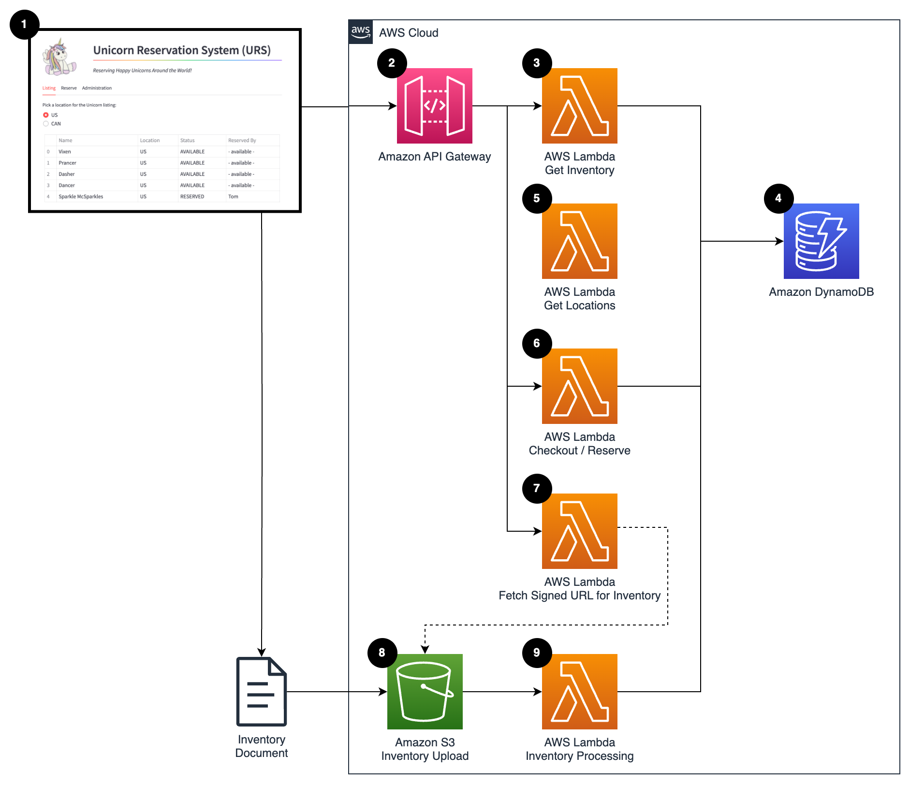
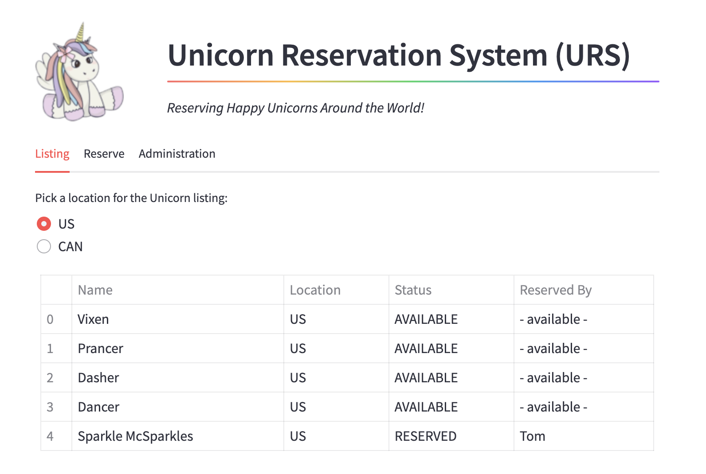

[](https://img.shields.io/badge/Python-3.9-green)
[](https://img.shields.io/badge/AWS-DynamoDB-blueviolet)
[](https://img.shields.io/badge/Test-Unit-blue)
[](https://img.shields.io/badge/Test-Integration-yellow)

# Python: Serverless Test Workshop

## Introduction
This project contains a sample application, written in Python, that we can use to develop tests.  The application is
a "Unicorn Reservation System" or URS.  The URS allows the user to upload a CSV file of Unicorns and their Locations.
The user can then reserve unicorns to individuals.  Magic!

---

## Contents
- [Python: Serverless Test Workshop](#python-serverless-test-workshop)
  - [Introduction](#introduction)
  - [Contents](#contents)
  - [Architecture](#architecture)
  - [Prerequisites](#prerequisites)
  - [Deploying the Project](#deploying-the-project)
  - [Sample User Interface](#sample-user-interface)
  - [Key Files in the Project](#key-files-in-the-project)

[Top](#contents)

---

## Architecture
The architecture is as follows:



1. The Unicorn Reservation System (URS) Application is a thin front-end, which makes API calls to the back-end services.
2. An Amazon API Gateway serves as the host for the back-end API calls, routing to Lambda functions based on the specific endpoint.
3. A Lambda function will query the Amazon DynamoDB Table [4] that stores the Unicorn Inventory.
4. An Amazon DynamoDB Table stores the list of Unicorns, including the Unicorn Name, Location, Reservation Status, and whom the unicorn is reserved for.
5. A Lambda function returns the list of potential locations for Unicorns.
6. A Lambda function handles the reservation of a Unicorn
7. A Lambda function produces a signed URL for a user to upload a CSV file.
8. A user can upload an inventory CSV file to an S3 Bucket.  Uploading a CSV file to the S3 Bucket triggers a Lambda Function [9].
9.  A Lambda function reads the CSV file in S3 and populates the DynamoDB Table [4].

[Top](#contents)

---

## Prerequisites

* [AWS CLI](https://docs.aws.amazon.com/cli/latest/userguide/getting-started-install.html)
* [AWS Serverless Application Model (SAM) CLI](https://docs.aws.amazon.com/serverless-application-model/latest/developerguide/serverless-sam-cli-install.html)
* [Python 3.9](https://www.python.org/downloads/)
* [Make build utility](https://www.gnu.org/software/make/)

[Top](#contents)

---

## Deploying the Project

The project uses the [AWS Serverless Application Model](https://docs.aws.amazon.com/serverless-application-model/latest/developerguide/what-is-sam.html) (SAM) CLI for configuration and deployment. 

The project Makefile contains helper commands for working with the project:
* ```make install```: Create a Python Virtual Envionment and install dependencies
* ```make deploy.g```: Deploy the stack to an AWS Account, prompting for stack parameters
* ```make deploy```: Deploy the stack to an AWS Account, best option for subsequent deployments
* ```make delete```: Remove the stack from AWS Account.  Note you will need to manually delete all the files in the S3 bucket to fully remove the stack.

[Top](#contents)

---

## Sample User Interface

There is a demo User Interface provided with this project, which will help with using the backend services.
To use this UI:
1. Execute the command `streamlit run demo-app/urs-ui.py --server.port 8080`
2. This will open the application in a browser window.
3. Start with the "Administration" tab.


4. For the "API Endpoint" field, enter the `ApiEndpoint` from the SAM/CloudFormation output.
5. Click "Save API Endpoint", and refresh the browser.
6. Return to the "Administration" tab, and Select `Browse Files` to choose an inventory CSV file.  There is an example inventory file provided in `demo-app\data\demo-data.csv`
7. Once processed, refresh the browser, and change to the "Reservation" tab.  Select a location, a Unicorn, and type in a name for the reservation.  Click `Reserve`.


8. Once complete, refresh the browser, and view the inventory on the "Listing" tab.



[Top](#contents)

---

## Key Files in the Project

* [template.yaml](template.yaml) : SAM Template for the back-end stack.
* [src/Checkout/app.py](src/Checkout/app.py) : Lambda Function for Unicorn Reservation API
* [src/GetInventory/app.py](src/GetInventory/app.py): Lambda Function for Unicorn Listing API
* [src/GetLocations/app.py](src/GetLocations/app.py): Lambda Function for Unicorn Locations API
* [src/GetSignedUrlForInventory/app.py](src/GetSignedUrlForInventory/app.py) : Lambda Function for the inventory S3 pre-signed URL.
* [src/InventoryProcessing/app.py](src/InventoryProcessing/app.py) : S3 Event handler for loading an inventory file from S3 to DynamoDB.
* [demo-app/urs-ui.py](demo-app/urs-ui.py) : Demo Streamlit UI
* [demo-app/config.json.sample](demo-app/config.json.sample) : Sample UI config file
* [demo-app/data/demo-data.csv](demo-app/data/demo-data.csv) : Sample Unicorn Inventory
  
[Top](#contents)

---

